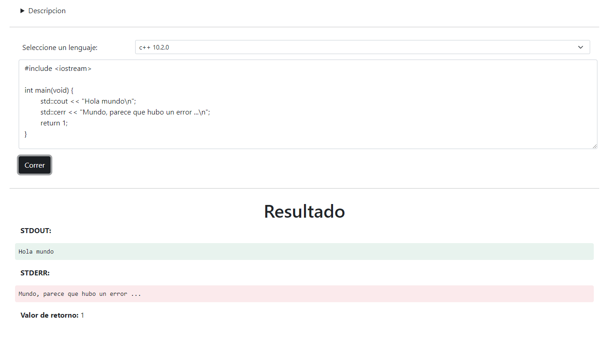
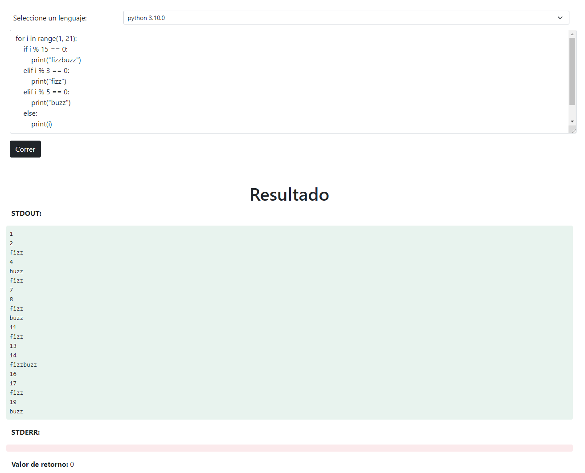

Programación Avanzada, Actividad 4
==================================

Pablo Sanchez Galdamez, Carnet 21001135.

<details>

<summary>
    Notas para la actividad 5
</summary>

Para crear la base de datos, corra en mysql el script ubicado en
`./scripts/create-db.sql`.

También tiene que crear las variables de entorno:

* `MYSQL_USER`: Con su nombre de usuario de `mysql`.
* `MYSQL_PASSWORD`: Con la contraseña.

Opcionalmente también puede reemplazarlos directamente en el código en
`main.js`:

```
// En la linea 5
const connection = mysql.createConnection({
    host: 'localhost',
    user: process.env["MYSQL_USER"], // eg. "root"
    password: process.env["MYSQL_PASSWORD"], // eg. "toor"
    database: "pa-actividad5"
});
```

</details>

API utilizada
-------------

Para este proyecto elegí usar `Piston API`. `Piston` es un motor de ejecución
de código de propósito general de alto rendimiento. Sobresale en la ejecución
de código no confiable y posiblemente malicioso sin temor a efectos dañinos.

La API consta de las siguientes urls:

```
GET  https://emkc.org/api/v2/piston/runtimes
POST https://emkc.org/api/v2/piston/execute
```

[Link a `Piston`](https://github.com/engineer-man/piston)

Descripción del funcionamiento de la aplicación
-----------------------------------------------

La app esta hecha para correr en electron y en un navegador normal. La interfaz
gráfica esta hecha con HTML y Bootstrap.

La app primero hace una petición a `runtimes` para conocer los lenguajes
disponibles.

Luego da la opción de elegir el lenguaje, y permite que se escriba el código.

Una vez se presiona el botón "Correr", se hace una petición a `execute` enviado
el lenguaje, versión, y código que escribió el usuario.

Una vez se recibe la respuesta, se le muestra al usuario el `stdout`, `stderr`,
y el valor de retorno del programa que escribió.

Imágenes
--------




